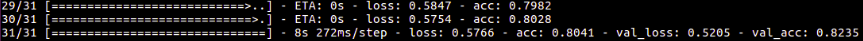
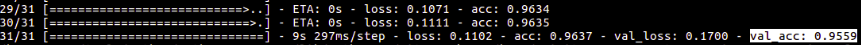
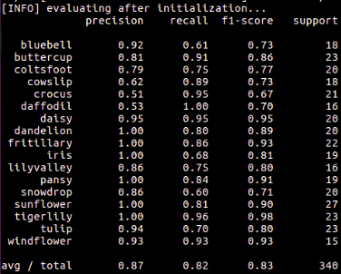
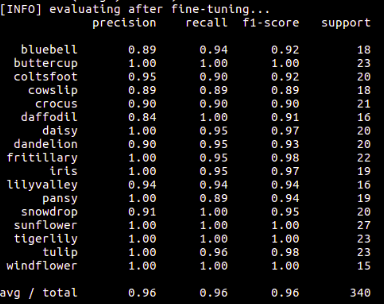

# kFineTuning
A keras example of fine tuning (aka transfer learning) on CNN-VGG16 for classification on oxford's flowers 17 data-set using imagenet weights.

## Introduction
This is by far the simplest yet the most impactfull deep learning project. This was my first deep learning project. My interest in finetuning began in saptember 2017 when supervisor for a color imaging project asked me to go through this nature paper by Esteva et al [Dermatologist-level classification of skin cancer with deep neural networks](https://www.nature.com/articles/nature21056). In this project a standford group is able to match accuracy of dermatologist in classifing skinn cancer, just by using this technique. 

Finetuning is very oftenly used when learning or classification on small dataset(roughly order of few k's) is required. The idea behind fine tuning is features learnt from one dataset are transferabel to other dataset. Even though the two dataset might have little in common. This is escpecially true for the shallow features of CNN(in early conv layers) which mostly tend to be edges and shapes. The deep features(conv layers in the end) are rather very specific to the datasets used for learning.

## Brief summary on 'How it is done?'
- First choose a pretrained network (VGG-16 with imagentes weights in present case)
- Then cut the head (fully connected part) of the CNN(selected netwrok) to get the CNN's body.
- Then attach a new fully connected head to the CNN's body. This new fc haed must has the final output nodes as equal to number of classes in your new dataset(flowers 17 dataset with 17 classes in present case, the architecture of this fc head in present case is FullyConnected(256 nodes)+ReLU => DropOut(0.5) => FullyConnected(17 nodes)+SoftMAx). This step is also known as pruning or network-surgery.
- Then allow back-propagation only till newly connected fc head by freezing the body of CNN also known as warm-up phase. The motivation beind freezing the body of CNN is that body has learnt lots of rich discriminative features which we do not want to change at sudden. Later on as we start getting good accuracy we can unfreeze the body. In most of the cases 90 % of best possible accuracy are achieved in warm-up phase, unfreezing the body can increase the acuracy by 5-10%.
- Once the warm-up phase is over and decent results are obtained. One can unfreeze the whole body of CNN or somepart of CNN's body to further increase the accuracy by 5-10%. If the accuracy seems bad in the warm-up phase then it is recommended to change the acrchitechure of new fc head, change the optimizer, learning rate etc.

This summary is only useful if you are familiar with theory of CNN's. Check out these two excellent tutorial if you are complete beginner 1.[Kera's official](https://blog.keras.io/building-powerful-image-classification-models-using-very-little-data.html) and 2.[P jay's blog on medium](https://medium.com/@14prakash/transfer-learning-using-keras-d804b2e04ef8)

## Key params
- This project is useful if one has a labeled dataset(doesn't matter what so ever) of the order of 1k and  one needs a CNN classfier for prediction on new smaples. Just replace the flowers17 dataset with you dataset. Make sure tha path of an image in your dataset is like this, yourDataset/Class1/image_x, yourDataset/Class2/image_y etc.
- One can determine the batch size, epochs for warm-up phase, epochs for final phase, the layers of CNN's body to be unfreezed in conf/myConfig.py. 

## Commands
``` shell
$ python finetune.py --dataset flowers17/ --model myModel.model 
```
- **--dataset**: Path to dataset on which you want to learn
- **--model**: Path to save new fine-tuned CNN model

## Results





